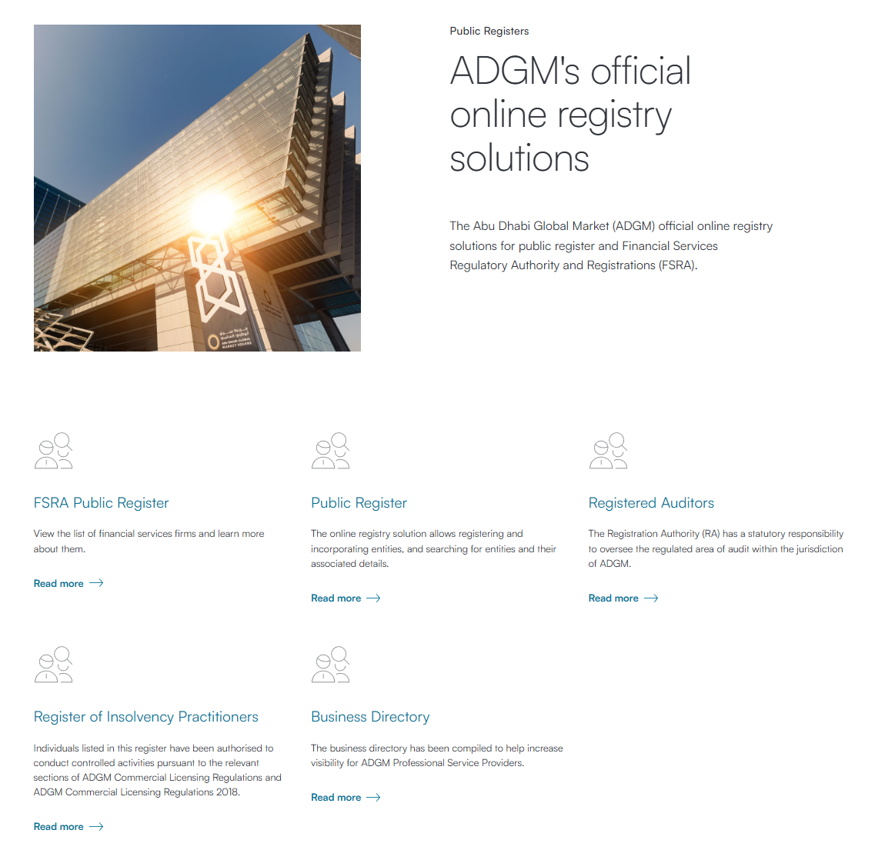

# ADGM Scraping Project

This project consists of two Node.js scripts for scraping data from the Abu Dhabi Global Market (ADGM) website:

1. `scrape_fsra_register.js`: Scrapes the Financial Services Regulatory Authority (FSRA) register.
2. `scrape_practitioners_register.js`: Scrapes the Register of Insolvency Practitioners.





## Prerequisites

- Node.js (version 12 or higher recommended)
- npm (Node Package Manager)

## Installation

1. Clone this repository or download the source code.
2. Navigate to the project directory in your terminal.
3. Run `npm install` to install the required dependencies.

## Usage

### FSRA Register Scraper

To scrape the FSRA register:

```
node scrape_fsra_register.js
```

This script will:
- Fetch company data from the ADGM FSRA API
- Parse the HTML content
- Extract detailed information for each company
- Save the results in JSON and CSV formats in the `companies` folder

### Insolvency Practitioners Register Scraper

To scrape the Register of Insolvency Practitioners:

```
node scrape_practitioners_register.js
```

This script will:
- Fetch practitioner data from the ADGM API
- Parse the HTML content
- Extract detailed information for each practitioner
- Save the results in JSON and CSV formats in the `practitioners` folder

## Output

Both scripts generate two types of output files:

1. JSON file: Contains the full scraped data in JSON format.
2. CSV file: Contains the scraped data in a tabular format, suitable for spreadsheet applications.

## Data Structure

### FSRA Register Data Structure

Each company entry in the FSRA register contains the following fields:

- name: Company name
- permissionNumber: Financial Services Permission Number
- link: URL to the company's profile on ADGM website
- financial_services_permission_number: Financial Services Permission Number (may be redundant with permissionNumber)
- company_status: Current status of the company (e.g., Active, Withdrawn)
- address: Registered address of the company
- date_of_financial_services_permission: Date when the financial services permission was granted
- legal_status: Legal form of the company
- phone: Contact phone number
- email: Contact email address

Example entry:

```json
{
  "name": "AD Investment Management Limited",
  "permissionNumber": "180039",
  "link": "https://www.adgm.com/public-registers/fsra/fsf/ad-investment-management-limited",
  "financial_services_permission_number": "180039",
  "company_status": "Active",
  "address": "Unit 7, level 7, Al Khatem Tower, Abu Dhabi Global Market Square, Al Maryah Island, Abu Dhabi, United Arab Emirates",
  "date_of_financial_services_permission": "12 February 2019",
  "legal_status": "Private Company Limited by Shares",
  "phone": "+971 2 692 6239",
  "email": "y.abdeen@adim.ae"
}
```

### Insolvency Practitioners Register Data Structure

Each practitioner entry in the Insolvency Practitioners register contains the following fields:

- name: Practitioner's name
- registrationNumber: Registration number
- dateOfRegistration: Date when the practitioner was registered
- email: Contact email address
- phone: Contact phone number
- employerName: Name of the practitioner's employer
- employerRegistrationNumber: Registration number of the employer
- businessAddress: Business address of the practitioner
- serviceAddress: Service address of the practitioner
- websiteAddress: Website of the practitioner or their employer
- profileLink: URL to the practitioner's profile on ADGM website

Example entry:

```json
{
  "name": "Ahmed Ali Ahmed Abdulla Alhosani",
  "registrationNumber": "ADGM-RA-000000031",
  "dateOfRegistration": "09 October 2023",
  "email": "Uae70uae@gmail.com",
  "phone": "+971552115151",
  "employerName": "AHMED ALHOSANI ACCOUNTANTS&AUDITORS ONE PERSON COMPANY L.L.C",
  "employerRegistrationNumber": "Limited Liability Company - Single Owner (LLC - SO) License No. 617542",
  "businessAddress": "Cloud Desk 302-D04, Level 11, Al Sarab Tower, ADGM square, Al Maryah Island, Abu Dhabi, UAE",
  "serviceAddress": "Cloud Desk 302-D04, Level 11, Al Sarab Tower, ADGM square, Al Maryah Island, Abu Dhabi, UAE",
  "websiteAddress": "www.ahab-uae.com",
  "profileLink": "https://www.adgm.com/operating-in-adgm/insolvency-practitioners/register-of-insolvency-practitioners/ip/ahmed-ali-ahmed-abdulla-alhosani"
}
```

## Dependencies

The project uses the following main dependencies:

- axios: For making HTTP requests
- cheerio: For parsing HTML and extracting data
- csv-writer: For writing data to CSV files
- fs.promises: For file system operations
- p-limit: For limiting concurrent operations (used in FSRA scraper)

## Notes

- The scripts use rate limiting to avoid overloading the ADGM servers. Please use responsibly.
- Ensure you comply with ADGM's terms of service and robots.txt when using these scrapers.
- The data structure may change if the ADGM website is updated. You may need to modify the scripts accordingly.

## Troubleshooting

If you encounter any issues:
1. Ensure all dependencies are correctly installed.
2. Check your internet connection.
3. Verify that the ADGM website structure hasn't changed.
4. Check the console output for any error messages.

For persistent issues, please open an issue in the project repository.